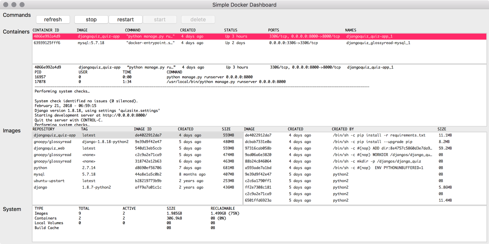

# simple-docker-dashboard
There are many great, multi-functinoal and beautiful GUI tools for docker engineers out there. As a beginner, however, I feel those are too complex for me to use in my development environment. Simple docker dashboard will give you quick overview on your docker environment. Moreover this tool will contribute to your fast understanding and learning curve at private development space.

Please don't expect many features surpassing great docker tools for commercial service operation. :)
What this GUI tool can reduce developers effort is the final goal to be achieved.

## Requirement
- Python 2.7.x
- wxPython 4.0.1

## Execution
python sddboard.py

## Current Feature
- Container/Image/System Information check
- Container survival (start,stop,restart )
- Process information of each container
- Logs of each container

## Roadmap
- Image management
- Network management
- Coloring for better readibility

